## 1. Set up Python environment

1. Create and activate a virtual environment:

```bash
# Create virtual environment
python -m venv venv

# Activate virtual environment
# On macOS/Linux:
source venv/bin/activate
# On Windows:
# .\venv\Scripts\activate
```

2. Install required packages:

```bash
pip install -r requirements.txt
```

## 2. Add dataset to the project

* Create a directory `data` and put `amazon_reviews.csv` file to the folder

## 3. Run docker compose file:

```bash
docker-compose up -d
```

What this file does:
* Starts a MongoDB container named **mongodb**.
* Creates a Spark container
* Runs `init.js` script in `./mongo-init` as an initialization script. It creates DB and collections.
* Run `/app/process_reviews.py` script to perform ingestion, cleaning, detailed aggregation, and saving results to MongoDB.
* Persists MongoDB data in a volume so it's not lost when the container is stopped or deleted.

Stop and remove all containers, networks, and volumes defined in docker-compose.yml:

```bash
docker-compose down -v
```

## Setup

### 1. Start MongoDB and Spark with Docker Compose
```bash
docker-compose up -d
```

## MongoDB Collections
- `product_reviews`: Review counts and average ratings per product
- `customer_reviews`: Number of verified reviews per customer
- `monthly_product_trends`: Monthly review counts per product

## Querying Results
You can connect to MongoDB using a client like `mongosh`:

```bash
docker exec -it mongodb mongosh
```

Example queries:
```js
// Product reviews
use amazon_reviews_db
db.product_stats.find({ product_id: 'product_id' })

// Customer review counts
db.customer_reviews.find({ customer_id: 'customer_id' })

// Monthly product reviews
db.monthly_product_trends.find({ product_id: 'product_id' })
```

## Screenshots

* Start docker-compose.yml

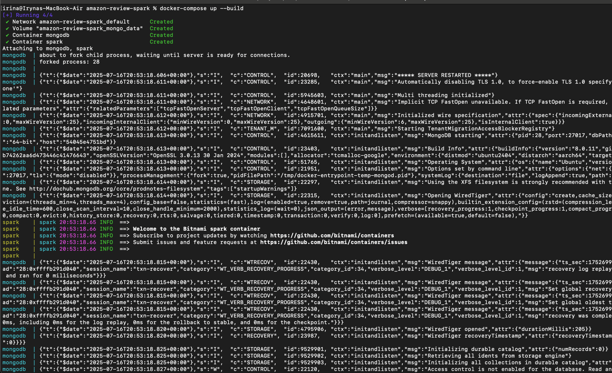

* Data in MongoDB

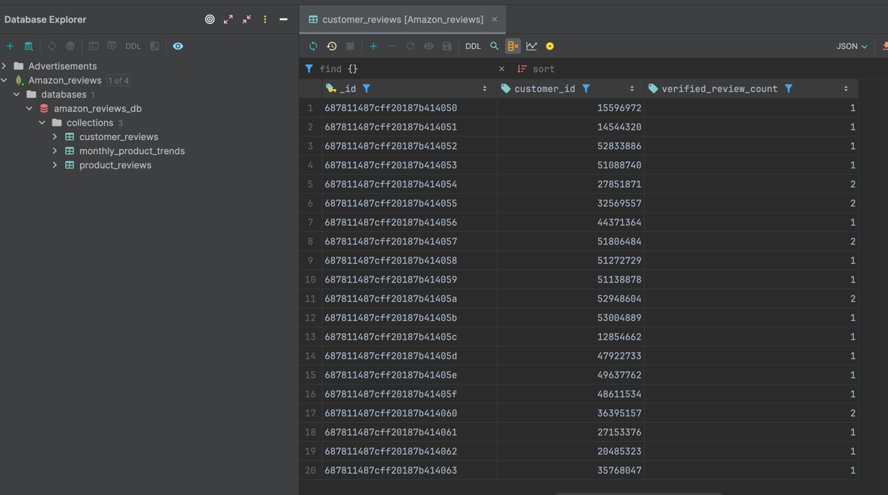

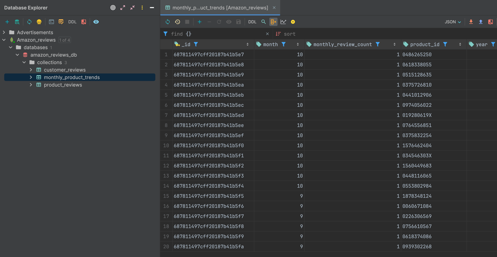

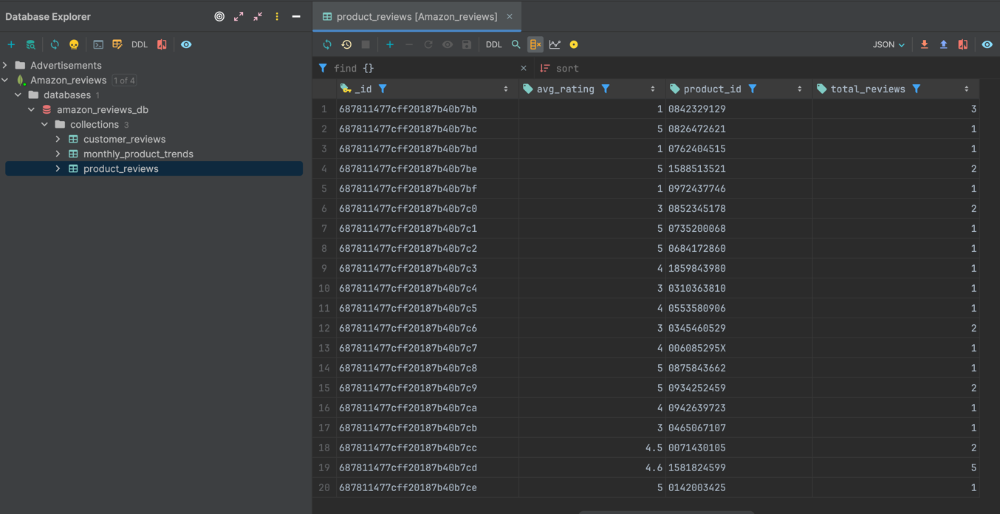

* Queries

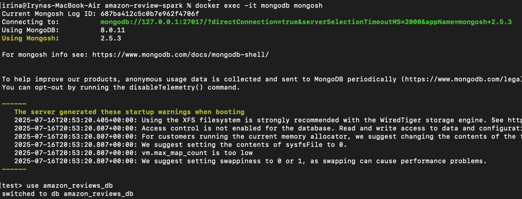
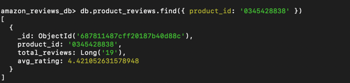
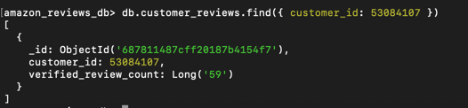
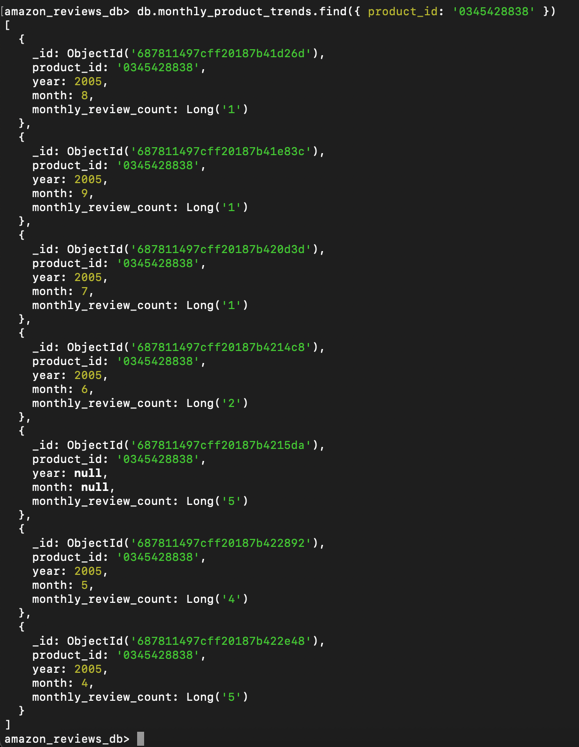


## Homework 7

### Create Cassandra tables and load data

You need just run docker-compose file. It creates Cassandra, Redis and API containers. Also,
it creates cassandra tables and starts ETL process.

```bash
docker-compose up -d
```

### Screenshots

- Data in Cassandra

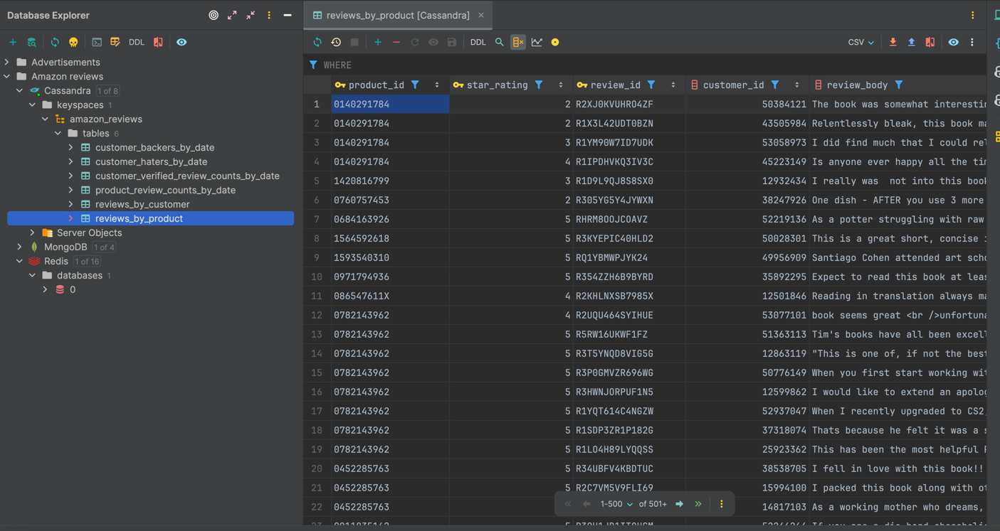

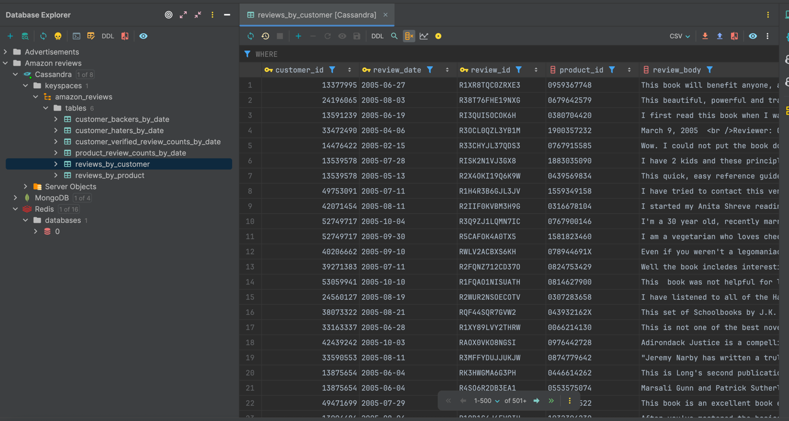

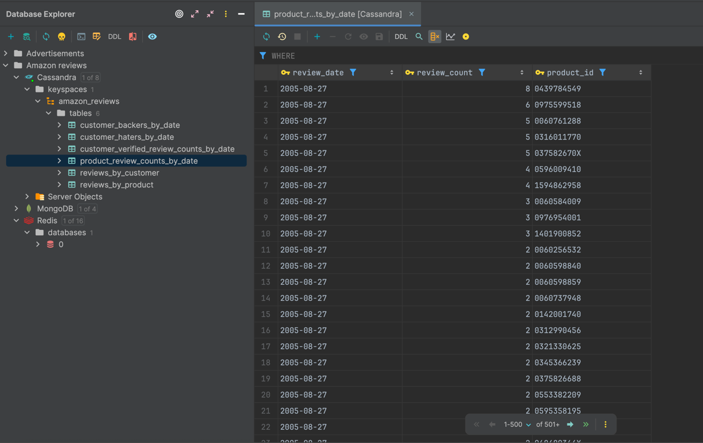

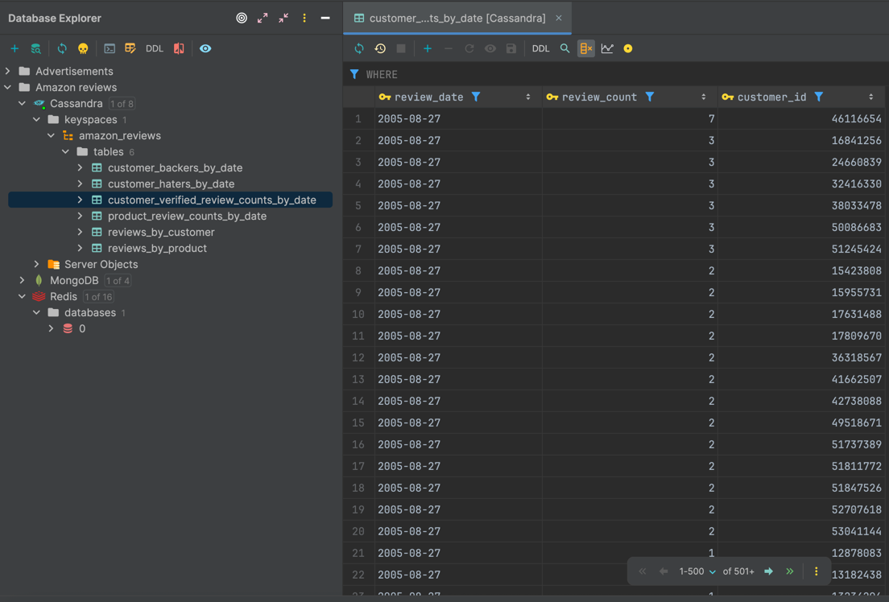

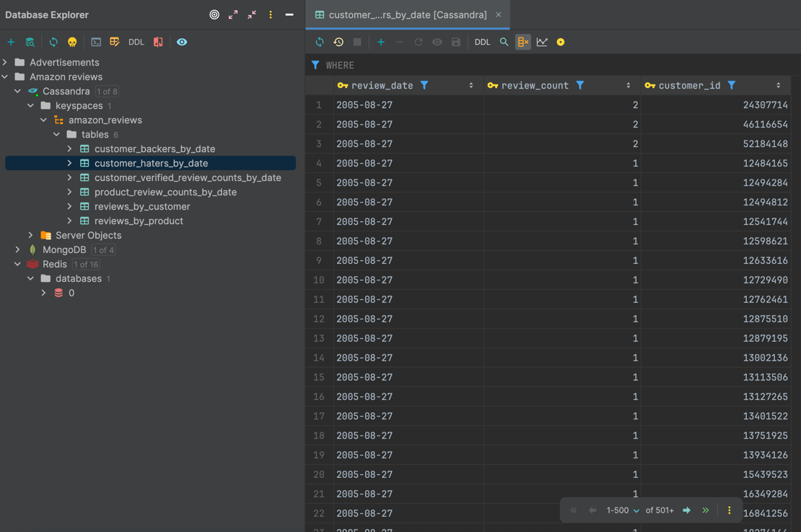

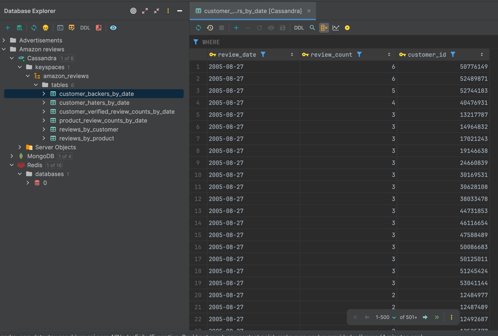

- API

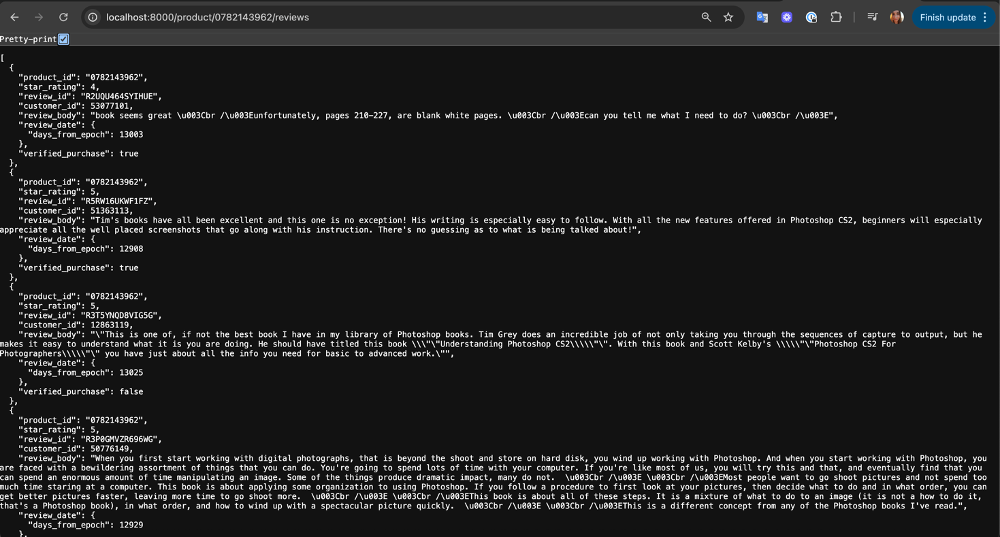

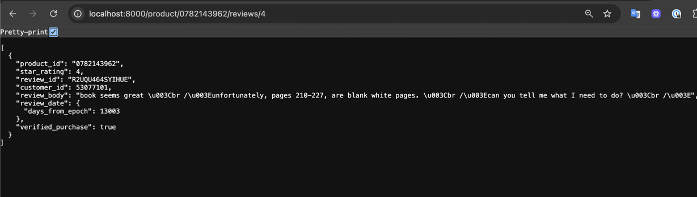

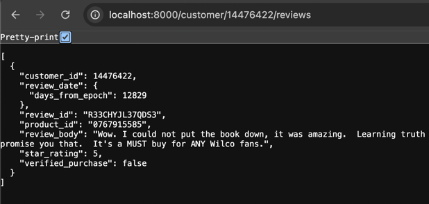

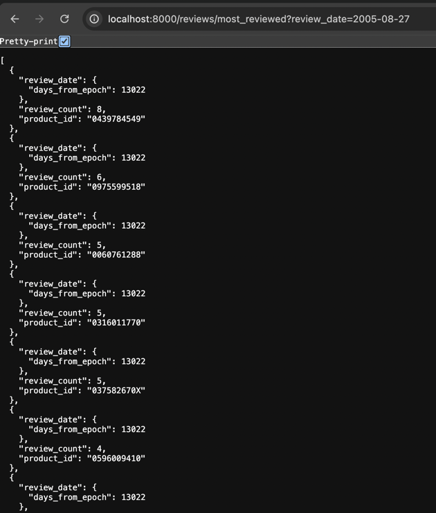

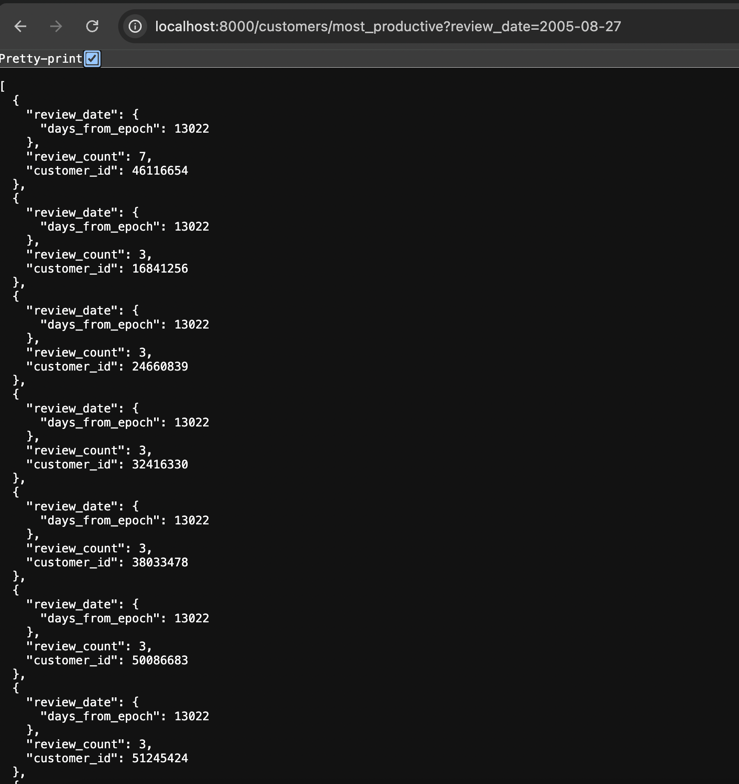

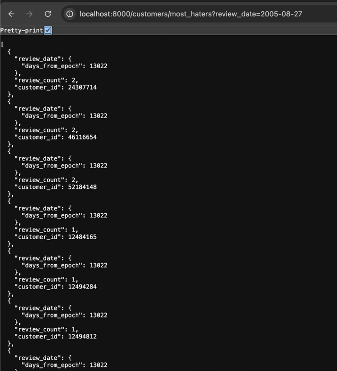

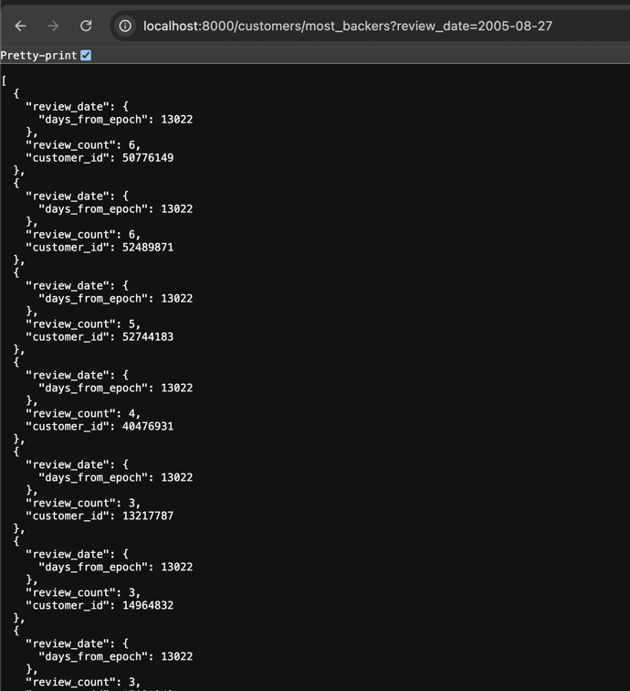